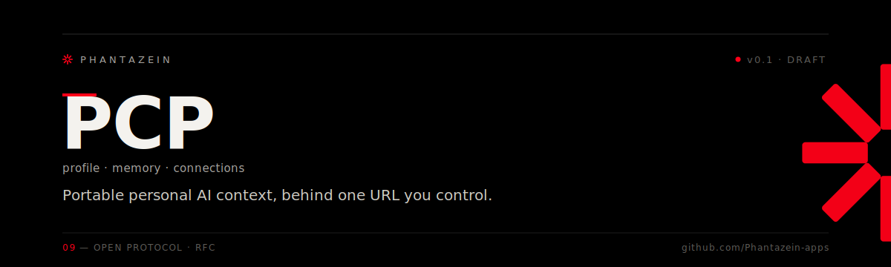

  
  
  
  

**An open protocol for portable personal AI context.**

Your memory, your profile, your connections — behind one URL that *you* control, pluggable into any MCP-enabled LLM on any device Part of the <a href="https://phantazein.com">Phantazein</a> toolkit

---

PCP defines two things:

1. **The format** — how a person's portable context is structured: a personal **profile** (identity, preferences, and consent-gated sensitive categories like health, legal, family, residency), long-term **memory** (PACK-compatible markdown + semantic index), and **connections** (Notion, Gmail, WhatsApp, tasks, …).
2. **The server** — the behavior of a **PCP server**: a single MCP endpoint that exposes all of the above as namespaced tools, protected by OAuth 2.1, discoverable, exportable, and self-hostable by anyone.

## Why

Today your personal context — what AI assistants know about you — is trapped inside the memory silos of large AI providers. It doesn't move between chatbots, doesn't move between devices, and you can't take it with you.

PCP inverts that ownership:

- **One endpoint, every LLM.** Connect Claude, ChatGPT, Cursor, a local model — any MCP client — via a single OAuth flow, and it instantly has your context.
- **Self-host or choose a host.** Run it on your own box, a Raspberry Pi next to your [Refugio](https://github.com/Phantazein-apps/refugio) install, or rent it from any hosting provider. The format is identical; switching hosts is an export + import.
- **Consent-scoped by category.** Health, legal, citizenship, family, and financial data live in separate extension namespaces with independent OAuth scopes. A coding assistant never sees your medical history unless you explicitly grant `profile.health:read`.
- **No lock-in, by construction.** Full export is a mandatory, conformance-tested part of the protocol.

## The key user story

> As a user, I open any MCP-enabled chatbot, paste my context URL, complete one OAuth consent screen choosing which scopes to grant, and the assistant immediately knows my preferences, my history, and can reach my connected tools — without any large organization owning that context.

## Pairing with Refugio

[Refugio](https://github.com/Phantazein-apps/refugio) is the *compute* refuge — a local LLM that never sends data to the cloud. PCP is the *context* refuge. Together they complete the sovereignty story:

- Refugio connects to your PCP endpoint as a standard MCP client — your local model gets the same memory and profile as Claude on your phone.
- A PCP server can run on the same machine as Refugio (`localhost` deployment profile) for a fully local, fully sovereign setup.
- Refugio's memory backends (MemPalace, PACK) use the same format PCP standardizes — a Refugio install can be promoted to a full PCP without data migration.

## Repository layout

| Path | Contents |
|---|---|
| [`SPEC.md`](SPEC.md) | The protocol specification (v0.1-draft) |
| [`schemas/`](schemas/) | JSON Schemas: profile core + extension namespaces |
| [`extensions/`](extensions/) | Extension namespace registry and authoring guide |
| [`SECURITY.md`](SECURITY.md) | Threat model + best practices for self-hosters and hosts |
| [`CONTRIBUTING.md`](CONTRIBUTING.md) | How to propose changes (spec is versioned, changes via PR) |

## Status

**v0.1-draft — request for comments.** Nothing here is stable yet. The reference implementation (runtime + connectors) is being built at Phantazein; this repo is the protocol only and is implementation-neutral by design.

## License

Specification text and schemas: Apache 2.0. "PCP" may be used to claim conformance, not endorsement. The protocol is stewarded by [Phantazein S.L.](https://phantazein.com); **MultiPass** is Phantazein S.L.'s hosted PCP provider and a separate trademark — implementations must not use the MultiPass name.

---

Stewarded by <a href="https://phantazein.com">Phantazein</a> · <a href="https://github.com/Phantazein-apps">more tools →</a>

